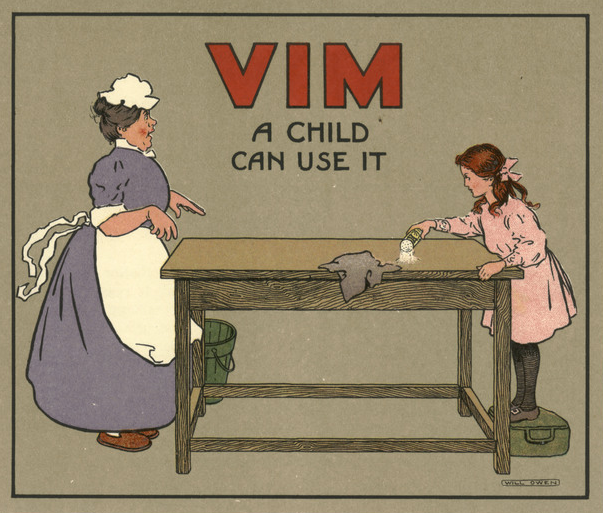

# Mini-Linux environment

This repo contains a streamlined configuration of my dotfiles, designed to work with any Linux distribution based on [Debian](https://www.debian.org/download)/[Ubuntu](https://ubuntu.com/#download) or within a Linux subsystem, such as [Microsoft WSL](https://learn.microsoft.com/en-us/windows/wsl/install) or [ChromeOS LDE](https://support.google.com/chromebook/answer/9145439?hl=en).

Minidot offers a ready&#x2011;to&#x2011;use, batteries&#x2011;included work environment but if you need [more gear](https://apps.gnome.org/), you can always rely on `apt`/[`snap`](https://snapcraft.io/docs/installing-snapd) or download any deb package and install it via `dpkg`.




## Packages included

```
git curl wget stow xclip trash-cli htop fzf ripgrep bat chafa poppler-utils wamerican witalian
dash bash bash-completion tmux vim-gtk3 exuberant-ctags fonts-mononoki fonts-firacode pandoc
gnome-keyring
```

For a detailed list of all the available packages, check out Debian and Ubuntu related pages [here](https://www.debian.org/distrib/packages) and [here](https://packages.ubuntu.com).


## More tools

[astronvim](https://astronvim.com/#%EF%B8%8F-installation), [vscode](https://code.visualstudio.com/Download), [vscode&#x2011;insiders](https://code.visualstudio.com/insiders/), [sublime&#x2011;text](https://www.sublimetext.com/docs/linux_repositories.html), [sublime&#x2011;merge](https://www.sublimemerge.com/docs/linux_repositories), [gitkraken](https://www.gitkraken.com/download), [google&#x2011;chrome](https://www.google.com/chrome/), [brave](https://brave.com/linux/), [min](https://minbrowser.org/), [extension&#x2011;manager](https://github.com/mjakeman/extension-manager#-installing), [input&#x2011;remapper](https://github.com/sezanzeb/input-remapper#installation), [tilix](https://gnunn1.github.io/tilix-web/#packages), [terminator](https://gnome-terminator.org/), [nerd&#x2011;fonts](https://gist.github.com/matthewjberger/7dd7e079f282f8138a9dc3b045ebefa0).
